# AyurPost — Final Specification

## Problem Definition

Small Ayurvedic clinics in India lack the time and expertise to maintain a consistent, credible social media presence. AyurPost automates the creation of short-form video reels (Instagram/YouTube) grounded exclusively in classical Ayurvedic texts, reducing content production from hours to minutes while keeping claims authentic and clinician-reviewed.

---

## Data Processing

**Source texts:** Sushruta Samhita (3 vols), Charaka Samhita (4 vols), Ashtanga Hridayam (1 vol) — all scanned PDFs with no clean digital editions available.

**OCR:** Google Document AI (Document OCR processor) applied to 15-page PDF chunks (API inline limit); output stitched per volume. Stray symbols, running page headers, and OCR garbles (e.g. `CHAPTER XIL` → 59, `VL` → 45) cleaned deterministically via round-trip Roman numeral validation before chunking.

### Chunking Strategy

Each source text has a distinct OCR structure requiring a tailored segmentation approach:

| Book | Chapter format | Structural challenge | Strategy |
|---|---|---|---|
| **Sushruta Samhita** (3 vols) | `CHAPTER I.` (Roman) with sthana running headers | Chapter numbers restart in each sthana (Sutrasthana ch1 ≠ Chikitsasthana ch1) | 3-signal segmentation: open header + closing colophon + page running header; sthana-aware dedup resets per sthana boundary |
| **Charaka Samhita** (4 vols) | Mixed Arabic/Roman: `CHAPTER 1-title`, `CHAPTER II` | OCR joins (`CHAPTERI`), digit substitutions (`CHAPTER 1V` for IV); multi-sthana per volume; duplicate sthana headers in back-matter | Running header change detection for sthana transitions; one-way transition guard prevents re-entry after back-matter false triggers |
| **Ashtanga Hridayam** (1 vol) | `CHAPTER N` (Arabic, clean) | No sthana markers; 30 chapters appear late in file (lines 19507+); first 19K lines are dense commentary | Simple body-start detection; no sthana needed |

All three use a two-pass approach: first **logical block extraction** (chapter and sthana boundaries via structural signals — headers, colophons, running headers), producing paragraph-level chunks. Paragraphs that fit within the 1,024-token limit are kept intact; only those that exceed it are further split with **LlamaIndex SentenceSplitter** (128-token overlap).

### Chunk Metadata

Each chunk carries two layers of metadata written back to `all_chunks.jsonl`:

**Structural** (from chunker):
```python
{
    "chunk_id":     "sushruta-vol1-sutrasthana-ch06-002",  # stable, unique
    "source":       "sushruta-vol1-sutrasthana",
    "chapter":      6,
    "sthana":       "Sutrasthana",      # sthana label, empty for Ashtanga
    "chunk_index":  2,                  # position within chapter
    "section_role": "topic",            # topic | verse_summary | prose
    "n_tokens":     312,                # approximate word count
    "text":         "...",
}
```

**Semantic** (from `tagger.py` — deterministic gazetteer, no LLM):
```python
{
    "doshas_mentioned":   ["vata"],           # HARD retrieval filter
    "dosha_combinations": ["vata-pitta"],     # tridosha / dual-dosha patterns
    "herbs":              ["triphala"],       # 45 herbs tracked
    "diseases":           ["prameha"],        # 23 disease terms tracked
}
```

Gazetteer matching uses word-boundary exact match with optional trailing `s`, NFKD diacritic normalisation, and canonical key storage (surface forms like `meha` → canonical `prameha`). `doshas_mentioned` is the **hard filter** applied at Qdrant query time — pitta chunks are never retrieved for a vata-season reel.

**Stack:** Google Document AI · LlamaIndex SentenceSplitter · Voyage AI `voyage-4-large` (dense, 1024-dim) · FastEmbed BM25 (sparse) · Qdrant Cloud (hybrid index, 4,785 points)

---

## Retrieval

Three complementary signals are required:

| Signal | Why |
|---|---|
| **Dense (Voyage)** | Semantic match across paraphrase and translation variation in 8 volumes |
| **BM25 sparse** | Exact Sanskrit term recall (`agni`, `triphala`, specific roga names that dense embeddings may miss) |
| **Dosha hard-filter** | Prevents pitta content leaking into vata-season reels; enforced at query time via Qdrant payload index |

RRF (Reciprocal Rank Fusion) merges dense + sparse scores; dosha filter is then applied as a post-filter on the fused result.

---

## System Design

### Diagram 1 — Knowledge Base Ingestion


PDFs are split into 15-page batches (Document AI's inline limit per request), OCR'd, then stitched into per-volume text files. The chunker applies sthana-aware segmentation to handle chapter-number restarts across sthanas, cleans noise lines (page numbers, running headers, OCR garbles), and passes text through SentenceSplitter. The tagger then adds dosha/herb/disease labels via exact gazetteer lookup — no LLM involved. Both dense (Voyage) and sparse (BM25) vectors are upserted with the full chunk payload, with payload indexes enabling O(1) dosha filtering at query time.

### Diagram 2 — Content Generation & Review

```mermaid
flowchart LR
    subgraph Schedule["📅 Schedule"]
        A[📋 Roadmap YAMLs\nSeasonal · Dosha · Services]:::yaml -->|Date to slot mapping| B[🗓️ calendar_engine.py\n20-slot posting cycle]:::sched
    end

    subgraph Generation["⚙️ Generation"]
        B -->|Pillar + topic descriptor| C[🔧 generate.py\ngenerate_dosha.py\ngenerate_services.py]:::gen
        C -->|Query + dosha filter| D[🔍 HybridRetriever\nRRF fusion · dosha hard-filter]:::retrieval
        D -->|Top-6 grounding chunks| E[🧠 Claude Opus 4.8\nStructured ReelScript\n3 scenes · MAX 25 words]:::llm
        E -->|Image prompt per scene| F[🎬 Veo 3.1 Lite\nHyper-realistic 9:16 · 8s clips]:::media
        E -->|Voiceover text per scene| G[🎙️ Chirp3-HD TTS\nen-IN · phonetic substitutions]:::media
        F & G -->|xfade + music bed + fade| H[🎞️ FFmpeg assembly]:::media
        H -->|DRAFT pending sign-off| I[📦 reel.mp4]:::artifact
        I -->|Per-scene groundedness check| J[✅ audit.py\nSonnet 4.6 structured judge]:::audit
    end

    subgraph Review["👩‍⚕️ Doctor Review"]
        I -->|GCS volume mount| K[🖥️ Streamlit App\nCloud Run · GCS]:::app
        K -->|Tiles by generation date| L[📆 Monthly calendar\ninline video player]:::app
        L --> M{Edit?}:::decision
        M -->|Yes - doctor types feedback| N[💬 Chat panel\nfree-text prompt]:::feedback
        N -->|Inject feedback into Opus\nkeep existing Veo clips| O[🔄 New script + TTS\nreassemble reel]:::gen
        O --> K
        M -->|No| P[✅ Ready to publish]:::publish
    end

    classDef yaml fill:#f3e8ff,stroke:#9333ea,color:#4c1d95
    classDef sched fill:#fef3c7,stroke:#d97706,color:#78350f
    classDef gen fill:#dbeafe,stroke:#2563eb,color:#1e3a8a
    classDef retrieval fill:#dcfce7,stroke:#16a34a,color:#14532d
    classDef llm fill:#ffe4e6,stroke:#e11d48,color:#881337
    classDef media fill:#fce7f3,stroke:#db2777,color:#831843
    classDef artifact fill:#e0f2fe,stroke:#0284c7,color:#0c4a6e
    classDef audit fill:#fef9c3,stroke:#ca8a04,color:#713f12
    classDef app fill:#ecfdf5,stroke:#059669,color:#064e3b
    classDef feedback fill:#f0fdf4,stroke:#16a34a,color:#14532d
    classDef decision fill:#fff7ed,stroke:#ea580c,color:#7c2d12
    classDef publish fill:#dcfce7,stroke:#16a34a,color:#14532d
```



Three roadmap YAMLs (seasonal, dosha education, clinic services) drive the full pipeline:

- **Scheduling** — `calendar_engine.py` assigns one of 20 rotating content slots to each posting date, selecting a pillar and topic
- **Retrieval** — a dosha hard-filter Qdrant query returns 6 grounding chunks from the KB
- **Script generation** — Claude Opus 4.8 writes a structured `ReelScript` (3 scenes, max 25 words each), citing only the supplied chunk IDs
- **Video** — Veo 3.1 Lite generates one hyper-realistic 9:16 clip per scene (hook + 3 scenes, 8s each)
- **Audio** — Chirp3-HD TTS synthesises the voiceover; FFmpeg assembles clips with xfade transitions and a ducked music bed
- **Audit gate** — **every reel passes through `audit.py` before it reaches the doctor**: Claude Sonnet 4.6 checks each scene for groundedness (voiceover must be supported by its cited passages) and compliance (no cure/reversal/quantified-outcome claims); result written to `audit_report.json`
- **Doctor review** — the Streamlit app (Cloud Run, GCS-mounted artifacts) shows reels on a monthly calendar; the doctor watches inline and can type voiceover feedback, which re-runs Opus keeping existing Veo clips

---

## Evals

**Task-specific (LLM-as-judge):** `audit.py` uses Claude Sonnet 4.6 as a structured judge after every generation. Checks: (1) groundedness — each scene's voiceover must be supported by its cited `chunk_id` passages; (2) compliance — no cure/reversal/quantified-outcome language (India Drugs & Magic Remedies Act / ASCI standards). Hook scene (scene 0) is exempt from groundedness; compliance applies to all scenes. Output: `AuditReport` with per-scene `SceneVerdict` and `overall_pass` boolean written to `audit_report.json`.

**Eval suite (`src/ayurpost/eval/`):**

| Category | File | What it checks | API calls |
|---|---|---|---|
| Structural | `eval_script.py` | hook non-empty, scene count vs manifest, voiceover ≤ 25 words, `grounded_chunk_ids` non-empty, disclaimer present | None |
| Retrieval | `eval_retrieval.py` | Dosha hard-filter (no pitta chunks in vata query), keyword presence, chunk prefix in top-k | Qdrant + Voyage |
| Compliance | `eval_audit.py` | 3 wellness-language cases must pass; 4 regulated-language cases must fail | Anthropic |
| Groundedness | `eval_audit.py` | Faithful paraphrase → grounded; fabrication/exaggeration → ungrounded | Anthropic |

Run with: `PYTHONPATH=src .venv/bin/python -m ayurpost.eval.run_evals [--category structural|retrieval|audit|all]`

## Prompt Templates

Prompt templates live inline in three orchestrator files — no separate template store:

| File | Prompt governs |
|---|---|
| `pipeline/content.py` | Seasonal reel script — Opus system prompt + `Scene` Pydantic field descriptions |
| `pipeline/generate_dosha.py` | Dosha education script — user message with dosha/topic/context injection |
| `pipeline/generate_services.py` | Clinic services script — user message with service label/category/context injection |

**Constraints encoded in prompts:** voiceover word cap (25 words), grounded-only claims (`grounded_chunk_ids` must reference supplied chunks; model is penalised if it cites chunk_ids not in context), no cure/reversal language, image prompt visual rules (no faces; dosha reels use elemental metaphors — wind/leaves for vata, fire/brass for pitta, earth/greenery for kapha; service reels allow anonymous treatment close-ups — hands, forehead receiving oil).

**Visual styles:** two Veo styles are available via `--cartoon` flag on `generate_dosha.py`. Default is `STYLE` (hyper-realistic cinematic). `CARTOON_STYLE` (soft 2D Indian illustration, pastel tones, stylized characters) is used for prakriti topic reels only — where body constitution is the subject and character representation aids comprehension. All other topics (personality, ailment, seasonal, remedy) and all seasonal/service reels use cinematic.

**Iteration pattern:** constraints are tightened by editing the field `description` strings in `Scene` (shared) or the user message in each orchestrator. A change takes effect on the next generation run — no deploy needed. The eval suite's structural checks act as a regression guard (word count, chunk citation format) so constraint drift is caught automatically.

## Cost & Performance
**Error handling:** Veo high-load (code 8) handled via skip-existing-clips logic; Voyage batch token limits managed with 20-text cap + 0.15 word-count margin (Sanskrit BPE expansion up to 7×); Qdrant upserts batched at 200 points to stay under 33 MB payload limit; OCR garbled Roman numerals rejected via round-trip validation (`VL→45` fails because `to_roman(45)="XLV"≠"VL"`).

**Cost (per reel):** ~$0.40 Veo (4 clips × 8s × $0.05/s) + ~$0.03 Opus script + ~$0.001 Voyage embeddings + ~$0.01 TTS. Total ≈ **$0.44/reel**.

**Latency:** Script generation ~30s (Opus + adaptive thinking) · Veo clip generation ~90–120s each (parallel-safe) · TTS ~5s · FFmpeg assembly ~10s. End-to-end ≈ **4–6 min** per reel. Voiceover-only edits (no new Veo) ≈ **45s**.
