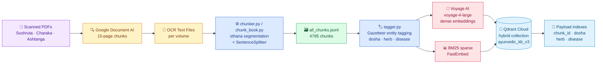

# AyurPost — Final Specification

## Problem Definition

Small Ayurvedic clinics in India lack the time and expertise to maintain a consistent, credible social media presence. AyurPost automates the creation of short-form video reels (Instagram/YouTube) grounded exclusively in classical Ayurvedic texts, reducing content production from hours to minutes while keeping claims authentic and clinician-reviewed.

---

## Data Processing

**Source texts:** Sushruta Samhita (3 vols), Charaka Samhita (4 vols), Ashtanga Hridayam (1 vol) — all scanned PDFs with no clean digital editions available.

**OCR:** Google Document AI (Document OCR processor) applied to 15-page PDF chunks; output stitched per volume. Stray symbols, diacritics, running page headers, and OCR garbles (e.g. `CHAPTER XIL`, `VL`) cleaned deterministically before chunking.

**Chunking:** 3-signal chapter segmentation (open header → closing colophon → page running header) with sthana-aware restart detection; SentenceSplitter at 1024-token target. Gazetteer entity-tagging (dosha, herb, disease) written back as payload metadata for hard-filter retrieval.

**Stack:** Google Document AI · LlamaIndex SentenceSplitter · Voyage AI `voyage-4-large` (dense) · BM25 (sparse) · Qdrant Cloud (hybrid index)

---

## Retrieval

Three complementary signals are required:

| Signal | Why |
|---|---|
| **Dense (Voyage)** | Semantic match across paraphrase and translation variation |
| **BM25 sparse** | Exact Sanskrit term recall (`agni`, `triphala`, specific roga names) |
| **Dosha hard-filter** | Prevents pitta content leaking into vata-season reels; enforced at query time via Qdrant payload index |

RRF (Reciprocal Rank Fusion) merges dense + sparse scores before the dosha filter is applied.

---

## System Design

### Diagram 1 — Knowledge Base Ingestion

### Diagram 2 — Content Generation & Review

```mermaid
flowchart LR
    subgraph Schedule["📅 Schedule"]
        A[📋 YAMLs\nSeasonal · Dosha\nServices]:::yaml --> B[🗓️ calendar_engine.py\n20-slot posting cycle]:::sched
    end

    subgraph Generation["⚙️ Generation"]
        B --> C[🔧 generate.py\ngenerate_dosha.py\ngenerate_services.py]:::gen
        C --> D[🔍 HybridRetriever\nRRF + dosha hard-filter]:::retrieval
        D --> E[🧠 Claude Opus 4.8\ngrounded ReelScript\n3 scenes · MAX 15 words]:::llm
        E --> F[🎬 Veo 3.1 Lite\nhyper-realistic 9:16 clips]:::media
        E --> G[🎙️ Chirp3-HD TTS\nen-IN voiceover]:::media
        F & G --> H[🎞️ FFmpeg\nxfade · music · fade]:::media
        H --> I[📦 reel.mp4\nDRAFT]:::artifact
        I --> J[✅ audit.py\nSonnet 4.6 judge\ngroundedness + compliance]:::audit
    end

    subgraph Review["👩‍⚕️ Doctor Review"]
        I --> K[🖥️ Streamlit App\nCloud Run · GCS]:::app
        K --> L[📆 Monthly calendar\ninline video preview]:::app
        L --> M{Edit?}:::decision
        M -- Yes --> N[💬 Doctor feedback\nin chat panel]:::feedback
        N --> O[🔄 Re-run Opus\nnew TTS · same clips]:::gen
        O --> K
        M -- No --> P[✅ Ready to publish]:::publish
    end

    classDef yaml fill:#f3e8ff,stroke:#9333ea,color:#4c1d95
    classDef sched fill:#fef3c7,stroke:#d97706,color:#78350f
    classDef gen fill:#dbeafe,stroke:#2563eb,color:#1e3a8a
    classDef retrieval fill:#dcfce7,stroke:#16a34a,color:#14532d
    classDef llm fill:#ffe4e6,stroke:#e11d48,color:#881337
    classDef media fill:#fce7f3,stroke:#db2777,color:#831843
    classDef artifact fill:#e0f2fe,stroke:#0284c7,color:#0c4a6e
    classDef audit fill:#fef9c3,stroke:#ca8a04,color:#713f12
    classDef app fill:#ecfdf5,stroke:#059669,color:#064e3b
    classDef feedback fill:#f0fdf4,stroke:#16a34a,color:#14532d
    classDef decision fill:#fff7ed,stroke:#ea580c,color:#7c2d12
    classDef publish fill:#dcfce7,stroke:#16a34a,color:#14532d
```

---

## Evals

**Task-specific (LLM-as-judge):** `audit.py` uses Claude Sonnet 4.6 as a structured judge after every generation. Checks: (1) groundedness — each scene's voiceover must be supported by its cited `chunk_id` passages; (2) compliance — no cure/reversal/quantified-outcome language (India Drugs & Magic Remedies Act / ASCI standards). Hook scene (scene 0) is exempt from groundedness; compliance applies to all scenes. Output: `AuditReport` with per-scene `SceneVerdict` and `overall_pass` boolean written to `audit_report.json`.

**Error handling:** Veo high-load (code 8) handled via skip-existing-clips logic; Voyage batch limits managed with 20-text cap + 0.15 margin; Qdrant upserts batched at 200 points to stay under 33 MB payload limit; OCR garbled Roman numerals rejected via round-trip validation.

**Cost (per reel):** ~$0.40 Veo (4 clips × 8s × $0.05/s) + ~$0.03 Opus script + ~$0.001 Voyage embeddings + ~$0.01 TTS. Total ≈ **$0.44/reel**.

**Latency:** Script generation ~30s (Opus + adaptive thinking) · Veo clip generation ~90–120s each (parallel-safe) · TTS ~5s · FFmpeg assembly ~10s. End-to-end ≈ **4–6 min** per reel. Voiceover-only edits (no new Veo) ≈ **45s**.
